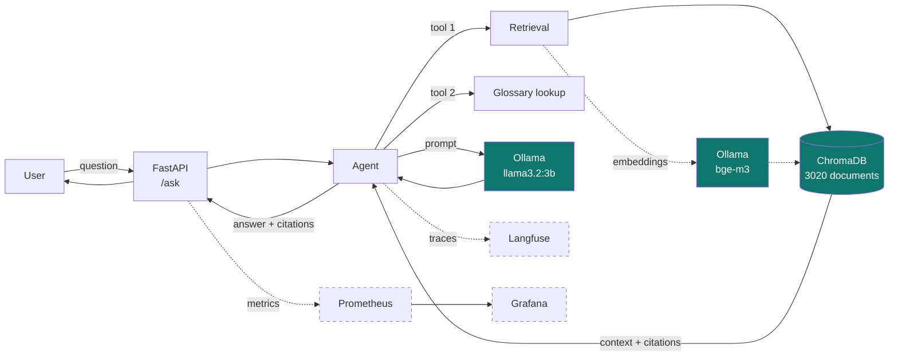
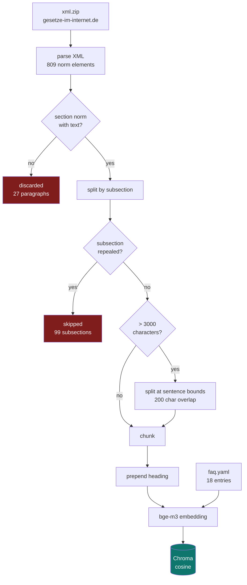

# Architecture

## Overview

Dashed: phase 3, not built yet.

## Ingest path

## Why these components

| Component | Choice | Reason |
|---|---|---|
| Embedding | `bge-m3` | multilingual, German corpus → [002](decisions/002-embedding-model.md) |
| Generation | `llama3.2:3b` | runs natively on the Mac with GPU, 2 GB |
| Vector store | ChromaDB | embedded, no separate service needed |
| Distance | cosine | standard for sentence embeddings; Chroma defaults to L2 |
| Package manager | uv | fast, locks versions, manages the Python version |

## Configuration

All settings come from environment variables so nothing has to be touched
inside a container (`src/health_faq_agent/config.py`):

| Variable | Default |
|---|---|
| `OLLAMA_HOST` | `http://localhost:11434` |
| `EMBEDDING_MODEL` | `bge-m3` |
| `CHAT_MODEL` | `llama3.2:3b` |
| `CHROMA_PATH` | `data/chroma` |
| `CHROMA_COLLECTION` | `sgb5` |
| `DATA_RAW_DIR` | `data/raw` |

!!! warning "Changing the model forces a re-index"
    Different embedding models produce different dimensions and live in
    different vector spaces. After changing `EMBEDDING_MODEL` you must run
    `ingest_sgb5.py --rebuild`.
