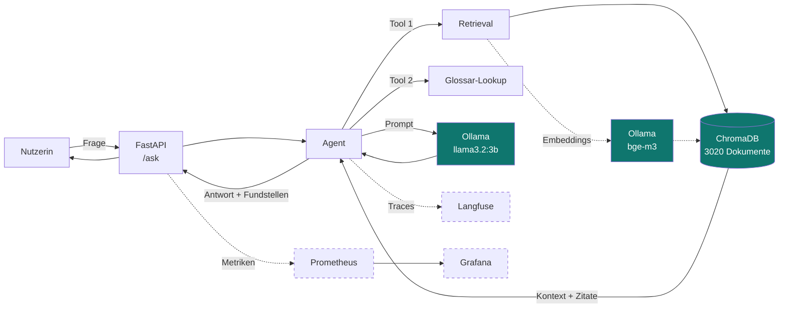
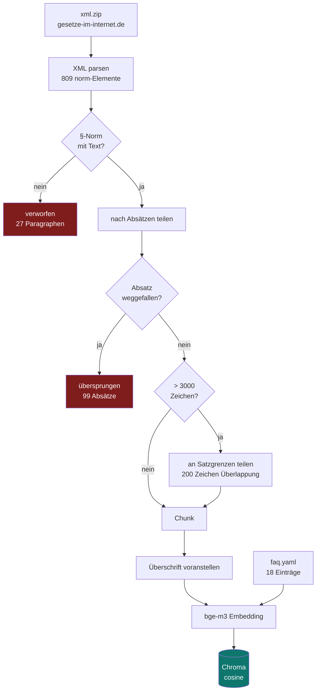

# Architektur

## Überblick

Gestrichelt: Phase 3, noch nicht gebaut.

## Ingest-Pfad

## Warum diese Bausteine

| Baustein | Wahl | Grund |
|---|---|---|
| Embedding | `bge-m3` | mehrsprachig, deutscher Korpus → [002](entscheidungen/002-embedding-modell.md) |
| Generierung | `llama3.2:3b` | läuft nativ auf dem Mac mit GPU, 2 GB |
| Vektorspeicher | ChromaDB | eingebettet, keine eigene Instanz nötig |
| Distanzmaß | Kosinus | Standard für Satz-Embeddings; Chroma-Default ist L2 |
| Paketmanager | uv | schnell, sperrt Versionen, verwaltet die Python-Version |

## Konfiguration

Sämtliche Einstellungen kommen aus Environment-Variablen, damit im Container
nichts angefasst werden muss (`src/health_faq_agent/config.py`):

| Variable | Default |
|---|---|
| `OLLAMA_HOST` | `http://localhost:11434` |
| `EMBEDDING_MODEL` | `bge-m3` |
| `CHAT_MODEL` | `llama3.2:3b` |
| `CHROMA_PATH` | `data/chroma` |
| `CHROMA_COLLECTION` | `sgb5` |
| `DATA_RAW_DIR` | `data/raw` |

!!! warning "Modellwechsel erzwingt Neuindexierung"
    Unterschiedliche Embedding-Modelle erzeugen unterschiedliche Dimensionen
    und liegen in unterschiedlichen Vektorräumen. Nach einer Änderung von
    `EMBEDDING_MODEL` muss `ingest_sgb5.py --rebuild` laufen.
